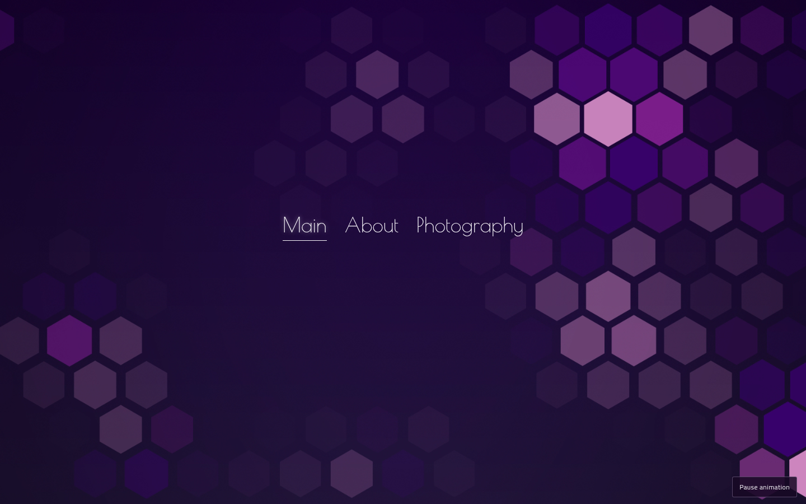
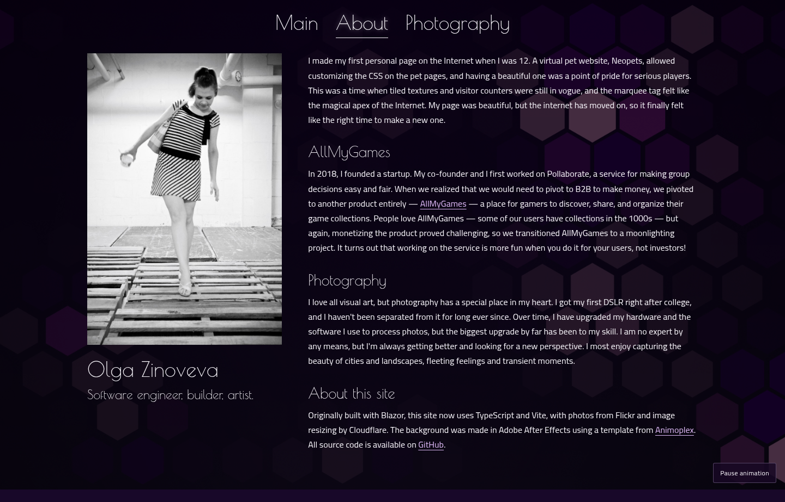
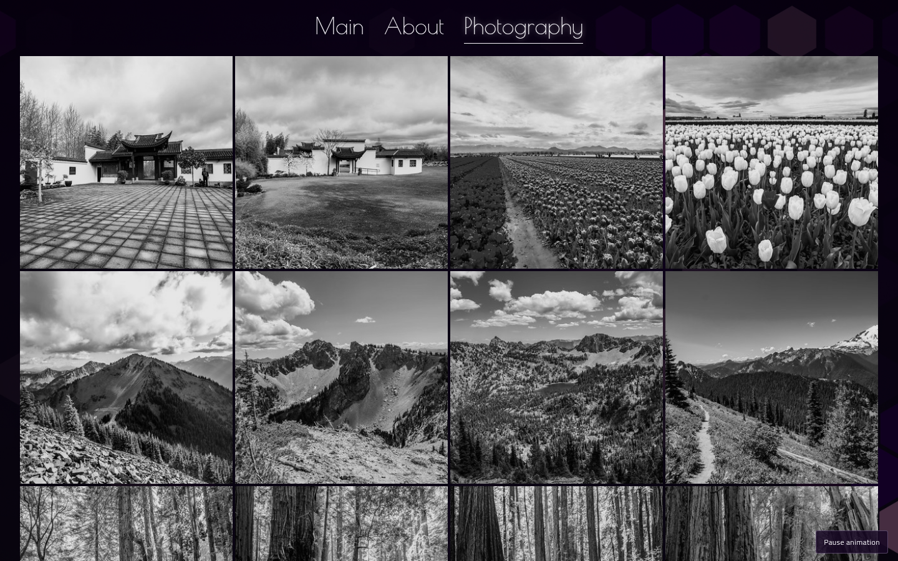
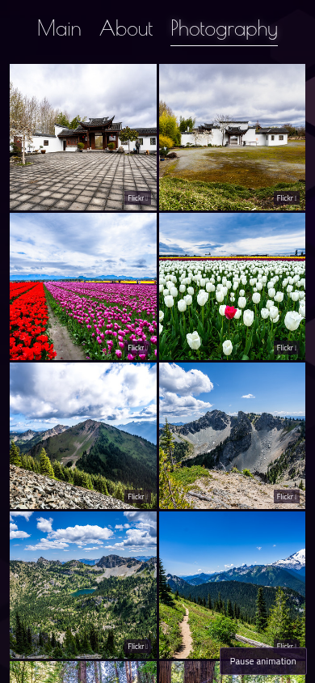
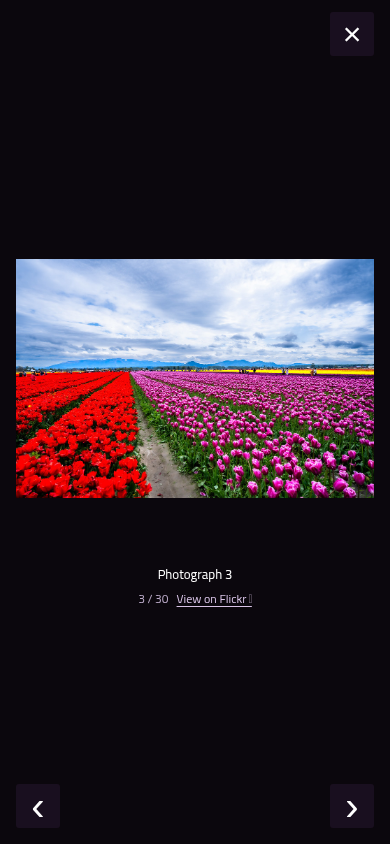

# Migration review screenshots

Captured from the actual Vite production build in Chromium at 1440×900 (desktop) and 390×844 (mobile). The About screenshot includes the full page. Home/About use local assets; gallery/lightbox use public existing-site photos supplied by a browser test fixture because the execution environment's proxy denied the live workers.dev endpoint. Generic titles are fixture data, not a content change. No certificate or browser security warnings were bypassed.

The purple MP4 design is unchanged. Desktop background playback was paused at a representative frame only for reproducible screenshots. Production playback continues across route changes; the test suite verifies video/document identity and playing state over repeated navigation.

## Home

## About

## Photography

## Phone gallery and lightbox

## Validation checklist

- Preserve the existing visual identity, background colors and home navigation placement.
- Review local portrait, readable About text, and retained biography content.
- Review desktop grayscale-to-color hover behavior and phone two-column layout.
- Test dialog close, next/previous buttons, left/right keys, Escape, focus restoration and Flickr attribution.
- Check the reduced-motion static background and manual pause/play control.
- Validate against the live Flickr metadata/resizing service on a network that can reach it before any cutover.
